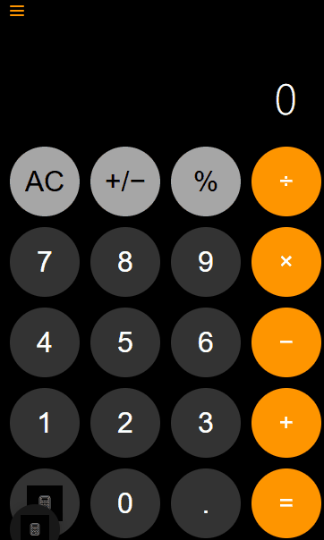

# Culichi iOS Calculator 🧮

<div align="center">
  
</div>




> Una calculadora web sofisticada inspirada en iOS con múltiples modos de cálculo y funciones avanzadas.  
> Construida con **Vite + React + TypeScript + Tailwind CSS**

## ✨ Características

- **Calculadora Estándar**: Operaciones aritméticas básicas (+, −, ×, ÷)
- **Modo Científico**: Funciones trigonométricas, logaritmos y exponenciación
- **Conversión de Unidades**: Conversiones de temperatura, distancia y peso
- **Historial de Cálculos**: Guarda y revisa cálculos pasados
- **Soporte de Teclado**: Soporte completo de teclado físico para entrada rápida
- **Diseño Inspirado en iOS**: Interfaz moderna y elegante siguiendo el lenguaje de diseño de Apple
- **Diseño Responsivo**: Optimizado para dispositivos de escritorio y móviles
- **Accesibilidad**: Etiquetas ARIA completas y navegación por teclado

## 🛠️ Stack Tecnológico

- **Framework**: React 18.3+ con TypeScript
- **Build Tool**: Vite 6.0+
- **Estilos**: Tailwind CSS 3.4+
- **Linting**: ESLint con TypeScript
- **Formateo**: Prettier
- **Type Safety**: TypeScript en modo strict

## 🚀 Inicio Rápido

### Prerequisitos

- Node.js 18.0 o superior
- npm o yarn

### Instalación

1. **Clonar el repositorio**:
   ```bash
   git clone https://github.com/ByCulichi/Calculator-Culichi.git
   cd Calculator-Culichi
   ```

2. **Instalar dependencias**:
   ```bash
   npm install
   ```

3. **Iniciar servidor de desarrollo**:
   ```bash
   npm run dev
   ```
   
   La aplicación estará disponible en `http://localhost:5173`

### Scripts Disponibles

```bash
# Desarrollo - Inicia servidor con hot reload
npm run dev

# Build - Compila para producción
npm run build

# Preview - Vista previa del build de producción
npm run preview

# Lint - Verifica código con ESLint
npm run lint
```

## 📁 Estructura del Proyecto

```
Calculator-Culichi/
├── public/                      # Archivos estáticos
│   ├── iconoCalaculadora.jpg    # Icono de la calculadora
│   ├── Animation.gif            # Animación demo
│   └── calculator.gif           # Demo de la calculadora
├── src/
│   ├── components/              # Componentes React
│   │   ├── Button.tsx           # Botón individual
│   │   ├── Display.tsx          # Pantalla de la calculadora
│   │   ├── History.tsx          # Panel lateral de historial
│   │   ├── Keypad.tsx           # Teclado completo
│   │   ├── ModeMenu.tsx         # Menú flotante de modos
│   │   └── SplashScreen.tsx     # Pantalla de bienvenida
│   ├── hooks/
│   │   └── useCalculator.ts     # Hook personalizado para lógica
│   ├── types/
│   │   └── calculator.ts        # Definiciones TypeScript
│   ├── utils/
│   │   └── calculator.ts        # Funciones puras de cálculo
│   ├── App.tsx                  # Componente principal
│   ├── main.tsx                 # Punto de entrada
│   ├── styles.css               # Estilos globales con Tailwind
│   └── vite-env.d.ts            # Declaraciones de tipos
├── .editorconfig                # Configuración del editor
├── .prettierrc                  # Configuración de Prettier
├── eslint.config.js             # Configuración de ESLint
├── index.html                   # HTML principal
├── package.json                 # Dependencias y scripts
├── postcss.config.js            # Configuración de PostCSS
├── tailwind.config.js           # Configuración de Tailwind
├── tsconfig.json                # Configuración de TypeScript
├── tsconfig.node.json           # TypeScript para Node
├── vite.config.ts               # Configuración de Vite
└── README.md                    # Este archivo
```

## 🎯 Atajos de Teclado

| Tecla | Acción |
|-------|--------|
| `0-9` | Entrada de dígitos |
| `+` | Suma |
| `-` | Resta |
| `*` | Multiplicación |
| `/` | División |
| `Enter` o `=` | Calcular resultado |
| `Escape` | Limpiar (AC) |
| `Backspace` | Borrar último dígito |
| `.` | Punto decimal |
| `%` | Porcentaje |

## 🎨 Personalización con Tailwind

El proyecto utiliza un tema personalizado definido en `tailwind.config.js`:

```javascript
colors: {
  'calculator-bg': '#F5F5F5',
  'calculator-panel': '#000000',
  'calculator-button-op': '#FF9500',
  // ... más colores personalizados
}
```

Los componentes utilizan clases de Tailwind y `@apply` para estilos reutilizables en `src/styles.css`.

## 🔧 Arquitectura del Código

### Gestión de Estado

El hook personalizado `useCalculator` maneja todo el estado de la aplicación:

```typescript
interface CalculatorState {
  buffer: string                 // Número actual en pantalla
  runningTotal: number           // Total acumulado
  previousOperator: BasicOperator | null  // Último operador usado
  calculatorHistory: string[]    // Historial de operaciones
  error: boolean                 // Estado de error
  overwrite: boolean             // Bandera de sobrescritura
}
```

### Componentes Principales

- **App.tsx**: Componente raíz que integra todos los componentes
- **Display**: Muestra el valor actual o mensajes temporales
- **Keypad**: Contiene todos los botones organizados en una cuadrícula
- **Button**: Componente reutilizable con variantes (default, operator, action, scientific)
- **History**: Panel lateral deslizable con historial de cálculos
- **ModeMenu**: Menú flotante para cambiar modos y activar conversiones
- **SplashScreen**: Pantalla de bienvenida con animación

### Funciones Puras

Todas las operaciones matemáticas están en `src/utils/calculator.ts`:

- `applyOperation()`: Operaciones básicas
- `applyScientificFunction()`: Funciones científicas
- `applyConversion()`: Conversiones de unidades
- `formatNumber()`: Formateo con locale es-MX
- `isValidInput()`: Validación de entrada

## 📊 Funciones Detalladas

### Modo Científico
- **Funciones Trigonométricas**: Cálculos precisos de seno, coseno y tangente
- **Logaritmos**: Logaritmo base 10 y logaritmo natural
- **Potencias y Raíces**: Cálculo de cuadrados y raíces cuadradas
- **Constantes**: Valores precisos de π y e

### Sistema de Historial
- **Persistencia**: Los cálculos se guardan automáticamente
- **Filtros de Tiempo**: Ver cálculos por períodos específicos
- **Edición**: Reutilizar cálculos previos
- **Gestión**: Borrado selectivo o completo

### Conversiones de Unidades
- **Temperatura**: Conversión precisa °C a °F
- **Distancia**: Conversiones métricas/imperiales (km↔mi, m↔ft)
- **Peso**: Conversión kg↔lb con factores exactos
- **Interfaz Intuitiva**: Botones dedicados con mensajes informativos

## 🧪 Calidad del Código

### Type Safety

El proyecto utiliza TypeScript en modo strict con tipos definidos para:
- Operadores básicos y científicos
- Estado de la calculadora
- Props de componentes
- Funciones de utilidad

### Linting

ESLint configurado con:
- Reglas de TypeScript estrictas
- React Hooks rules
- React Refresh plugin

### Formateo

Prettier configurado para mantener consistencia:
- Sin punto y coma
- Comillas simples
- 2 espacios de indentación
- 80 caracteres por línea

## 🌐 Accesibilidad

- **ARIA Labels**: Todos los botones tienen etiquetas descriptivas
- **ARIA Live**: La pantalla anuncia cambios para lectores de pantalla
- **Navegación por Teclado**: Soporte completo de teclado
- **Focus Visible**: Indicadores visuales claros de foco
- **Contraste**: Colores con alto contraste para legibilidad

## 🔄 Migración desde Vanilla JS

Este proyecto fue migrado de Vanilla JavaScript a React + TypeScript:

### Cambios Principales
- ✅ Lógica de estado movida a hooks de React
- ✅ DOM manipulation reemplazado por declarative React
- ✅ Tipos TypeScript para toda la aplicación
- ✅ CSS modular con Tailwind CSS
- ✅ Build optimizado con Vite
- ✅ Componentes reutilizables
- ✅ Mejor separación de responsabilidades

### Características Preservadas
- ✅ Todas las funcionalidades originales
- ✅ Diseño visual idéntico
- ✅ Soporte de teclado completo
- ✅ Accesibilidad ARIA
- ✅ Conversiones de unidades
- ✅ Modo científico
- ✅ Sistema de historial

## 🚀 Despliegue

### Build de Producción

```bash
npm run build
```

Esto genera archivos optimizados en el directorio `dist/`:
- HTML minificado
- CSS optimizado y purgado (solo clases usadas)
- JavaScript minificado y tree-shaken
- Assets optimizados

### Previsualización Local

```bash
npm run preview
```

Sirve el build de producción en `http://localhost:4173`

### Opciones de Hosting

El proyecto puede desplegarse en:
- **Vercel**: `vercel --prod`
- **Netlify**: Arrastra la carpeta `dist/`
- **GitHub Pages**: Usa GitHub Actions
- **Cualquier servidor estático**: Sube el contenido de `dist/`

## 📝 Desarrollo

### Agregar Nuevas Funciones

1. Define tipos en `src/types/calculator.ts`
2. Implementa lógica pura en `src/utils/calculator.ts`
3. Actualiza el hook `useCalculator` si es necesario
4. Agrega UI en componentes correspondientes

### Personalizar Estilos

1. Modifica colores en `tailwind.config.js`
2. Ajusta componentes reutilizables en `src/styles.css`
3. Usa clases de Tailwind en componentes

### Ejecutar Linter

```bash
npm run lint
```

## 🤝 Contribuciones

Las contribuciones son bienvenidas. Por favor:

1. Fork el repositorio
2. Crea una rama para tu feature (`git checkout -b feature/AmazingFeature`)
3. Commit tus cambios (`git commit -m 'Add some AmazingFeature'`)
4. Push a la rama (`git push origin feature/AmazingFeature`)
5. Abre un Pull Request

## 📄 Licencia

Este proyecto es open source y está disponible bajo la [MIT License](LICENSE).

## 👨‍💻 Autor

**Christian (ByCulichi)**
- GitHub: [@ByCulichi](https://github.com/ByCulichi)
- Proyecto: [Calculator-Culichi](https://github.com/ByCulichi/Calculator-Culichi)

## 🙏 Agradecimientos

- Inspirado en la calculadora de iOS
- Construido con herramientas modernas de desarrollo web
- Comunidad de React, TypeScript y Tailwind CSS

---

Hecho con ❤️ por ByCulichi
